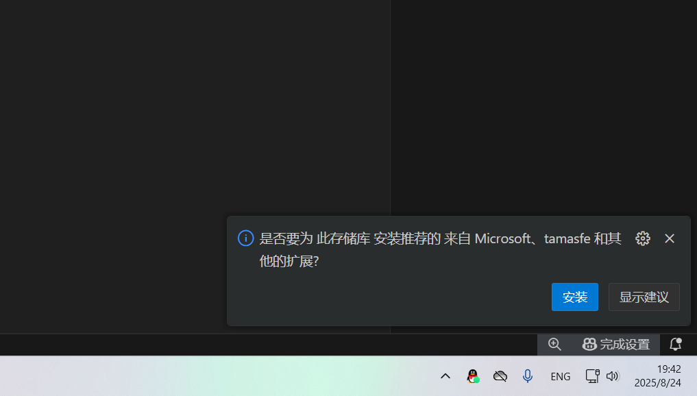

# wiki共学营大致逐字稿

同学们好。

在开始之前，我想先问大家一个问题：

在你们之前的印象中，"后端"是做什么的？

有没有同学愿意分享一下自己的想法？哪怕只是一个词或者一个模糊的印象都可以。

（等待可能的回答，如果有人回答就回应："很有意思的想法"、"这个角度很独特"等）

其实很多同学可能会觉得后端很"神秘"，因为我们平时上网、刷视频、玩游戏的时候，看到的都是漂亮的界面或者流畅的动画，完全看不到后端在哪里。

不过也没有关系，我们今天这个课就是为了给大家揭开后端的神秘面纱 ( 揭开他们的面纱（x ) 

同学们不用怕自己今天这个课看不懂啊，今天我们不讲那些难懂的技术名词。我拿大家喜闻乐见的游戏来给大家讲讲，后端这玩意儿到底是个什么。

## 后端简介

首先我做个小互动啊，现在看直播的各位有没有玩过“城市天际线”这个游戏的，听说过这个游戏也行，有的话在弹幕上发个 1。

(假装有很多弹幕)

好，我看到有很多同学扣 111 的啊。我稍微科普一下，天际线这个游戏是个城市规划运营类游戏。在这个游戏，我们要从零开始规划和建设一座城市。

事先声明，我其实自己没玩过这个游戏。但是我还是很想说说这个游戏。

为什么呢，是因为，我们去看整个计算机领域，其实就很像是去搭建一个数字城市。

我们就拿天际线来作为今天的例子，自下而上地讲讲整个计算机领域的全貌。这样你会理解后端在整个计算机领域的生态位究竟是什么样的。

### 计算机领域整体速通  

现在假设我们新开了一个天际线存档。

#### 硬件 - 城市的基建

天际线里面，你首先给城市选了一块地。这里有水源，矿产，是平原或者山地。这些就是硬件的基础材料。

光有资源不行，你要把这些资源变成基础设施。

CPU 就是城市的发电厂，或者说基础的工业区。硬盘可能是城市的大型仓库，长期存储一些资源。

我们还有货运集散中心，临时存放一些待处理的货物。它相当于我们的内存。准备处理的那些货物就预先临时存在这里，比直接从仓库里拿要快得多，但空间可能没大型仓库那么大。内存在计算机其实就是干这个快速中转的事。

硬件工程师就负责规划这些城市基建设施怎么建设，电厂建在哪里，怎么建，道路怎么规划。

#### 操作系统 - 市政厅

硬件之上，我们有操作系统，它相当于是市政厅。天际线里面的市政厅更多地应该是个象征性的建筑。我们假设它现在真的有实际功能。

操作系统可以管理和分配硬件资源。负责跟硬件打交道。

就像市政厅，可能需要颁发政策，管理预算，调度资源，维持秩序，或者给城市建立区域划分，这一块是住宅，这一块是商业，这一块是工业。

这就是操作系统干的事。Windows 不也分了系统盘嘛。各种程序如果要内存，或者计算资源，软件底层实现也是要从操作系统这里获取。

#### 应用软件 - 城市商业建筑

有了这些基建设施之后，城市肯定要有商业区，他们相当于是应用软件。

抖音是个大型娱乐中心。淘宝是个超级市场。

作为市民，我们到商场里面直接看到直接玩到的东西，光鲜亮丽，决定了城市游客的第一印象。这部分我们叫他 **前端**。

就像饭店的前厅，装修得漂漂亮亮，有菜单，有服务员跟你点菜。

说到饭店，我们就拿饭店来讲讲后端。

### 后端的地位 - 后厨

我们想象现在是开了一家饭店。去一个餐厅吃饭，你看到的是漂亮的装修、精致的菜单、穿着制服的服务员。但你吃的那盘菜，是谁做的？在哪做的？食材从哪来？垃圾往哪倒？

全是后厨在干。

后厨里面有什么？

（蟹堡王图片）

厨师团队：他们就是核心业务逻辑。用户一下单，比如下单买了本书。后端的“厨师”就得忙起来：查库存还有没有（数据库查询）、算一下多少钱（业务逻辑）、生成订单记录（数据处理）、通知仓库发货（调用其他API）。最后发现饭店压根不应该卖书。这一套行云流水的操作，就是后端的要负责设计的那些核心业务逻辑。

仓库和冰箱：这就是数据库。所有的食材（用户信息、商品数据、订单记录）都得整整齐齐地码在这里。厨师要啥，就得快速准确地拿到。这仓库还得防火防盗防痞老板，那些就是关于数据安全和备份。

传菜窗口：这就是 API。前台服务员把订单塞到窗口，喊一声“美味蟹皇堡一份”。后厨做了汉堡，又通过这个窗口递出来。这个窗口，就是前后端沟通的协议和桥梁。没了它，前厅和后厨就彻底失联了。

厨房的标准化装修：这就是后端框架，比如你可能听说过的Java的Spring Boot, Python的Django，node.js的Express 等等。它直接预设好了灶台放哪、菜板放哪、水槽在哪。新厨师来了，不用自己吭哧吭哧搭灶台，直接就能上手炒菜，效率极高。

厨师长和后厨经理（海绵宝宝）：他们就是负责运维。负责保障后厨高效运转。客人多了，就是高并发，就得加人手、加灶台，给服务器扩容；还得设计好流水线，让切菜、炒菜、洗锅的人能协同工作，这是应用架构；

最重要的是，看着火，保证炉灶别炸了，这是服务器稳定运行。

总之，后端负责了这些幕后工作。后端实际决定了这家饭店的能力。它决定饭店有什么花样的菜，决定了菜好不好吃，上菜快不快，能同时接纳多少客人，客人吃了会不会变身喷射战士。

所以学了后端开发，你就是大厨师长了。（哥布林厨师长.jpg）

## 后端核心流程

好了，我觉得我们的宝宝巴士已经把后端在计算机领域的生态位给搞清楚了。总之它确实是个幕后英雄，但现在大家有没有觉得，它也没有那么神秘了。

我们光知道后端在幕后没啥意思。我们来看一看后端最核心的逻辑。

后端最核心的流程，可以概括为，处理请求并返回响应的闭环过程。接收请求 → 处理数据 → 返回响应。

---

我们再来一个游戏。我用 Minecraft 这个游戏，给大家体验一下，后端的核心流程到底是怎么样的。

前面天际线我虽然没玩过，但 Minecraft 我是真老玩家了。玩过 MC 的同学，弹幕再发一个 1 让我看看。

(假装有很多 111)

好，看来方块人还是挺多的啊。那我们直接开讲。假设说我们现在开了一个 MC 服务器。

(打开Minecraft，拿着铁镐，对着钻石矿)

我们现在在一片矿洞里，面前就有一个钻石矿。我现在要挖它。

钻石矿从地图上消失了，生成了一个钻石掉落物。捡起来，背包里多了一个钻石。

整个过程都看起来非常流畅自然，对不对。但是呢，实际上这样一个简单的操作，背后就存在着前后端

(PPT 图片，大概是 MC 客户端和 server.jar)

听完前面的天际线讲解，你肯定知道这里我们的服务端就是相当于后端。客户端就是前端。

其实MC的客户端和服务端就是一个前后端概念。Client / Server，C/S 模型。

客户端就负责显示画面，播放声音，处理你的键盘鼠标输入，发送数据包给服务端。

服务端就负责计算方块更新，管理玩家背包，同步玩家位置，验证操作合法，还负责留着玩家存档地图存档等等。

我们假设现在你在服务器挖了一个钻石矿：

第一步，你按住鼠标，挖掉了这个钻石矿。

你的客户端告诉服务器，玩家 V3n0 挖掘了 (114, -51, 4) 这个方块！

第二步，我们的服务器来了。它不会听客户端的一面之词，它要做一系列核查。

先查下地图，(114, -51, 4) 这地方是什么方块？是钻石矿

那么我们就更新地图数据，这里的钻石矿删除。

我们又看看玩家手里的工具，是铁镐，那么我们生成一个钻石掉落物。

服务器处理完所有这些事情之后，它会生成一个“通知”，发给你和服务器里的所有其他玩家。通知说，坐标(114, -51, 4)的方块消失了，那里现在有一个钻石掉落物！

你的电脑和其他玩家的电脑收到这个通知后，才根据通知内容，更新各自电脑上的游戏画面。于是你看到了钻石掉落，别人如果在你旁边，也会同步看到这个结果

所以，一个简单的挖矿动作，并不是你的电脑说了算，而是由服务器这个大脑计算后，再通知所有电脑统一更新画面。这就是多人游戏能同步的关键！

---

我们现在切回PPT，用后端视角，来理解一下这个过程后端在做什么：

还记得吧，我们说后端做的最核心的逻辑，就是三步，接收请求 → 处理数据 → 返回响应

第一步，前端发起了一个请求数据包，这个请求中后端接收后可以读取到，玩家 V3n0 挖掘了 (114, -51, 4)

第二步，后端处理这个数据。

后端核实这里的方块是钻石矿，这相当于数据库查询。

我们还检查玩家手上的物品，如果是铁镐，才能掉落钻石。这相当于权限与验证的逻辑。

更新地图、生成掉落物、减耐久，这是业务逻辑与数据库更新。

第三步，返回响应，我们的服务器把玩家挖掘带来的一系列影响都告诉客户端。而后面的客户端的更新界面，就已经不再是后端的工作了

总之来说，这就是后端工作的核心，后端说白了就是在：接受请求，处理数据，返回响应。而且这个过程非常非常快，所以你的游戏体验非常丝滑。

---

但是，很多时候，后端的工作也没有上面说的那么简单。

问题来了，假如两个玩家同时想拾取这个钻石掉落物，会发生什么。

这就是后端要处理的核心难题之一，并发冲突！

服务器必须是一个公正的裁判。钻石归谁？总不能说两个人都能拿到一个钻石吧，怎么告诉另一个玩家，你没能拾取到钻石呢？

这些问题的解决方案：数据库锁机制，事务处理，数据一致性等等的知识，就是后端开发者的本领了。这里我们就不展开说这些知识了，你们以后学后端一定会遇上这些的。

## 第一个 API

好了，理论讲的差不多了，可能不爱玩游戏的同学已经听困了是吧。

没关系，下面我们来点真的。带大家实现自己的第一个后端服务器。

没写过代码的同学不用怕，这里我们不需要有任何编程基础，只要你会复制粘贴，或者照着打字就行。重在体验。

我们用的是 Python 和 FastAPI，这是对新手最友好的语言和框架之一了。

框架大家还记得是啥吧，还记得的扣2。

厨房的标准化装修：这就是后端框架，比如你可能听说过的Java的Spring Boot, Python的Django，node.js的Express 等等。它直接预设好了灶台放哪、菜板放哪、水槽在哪。新厨师来了，不用自己吭哧吭哧搭灶台，直接就能上手炒菜，效率极高。

废话不多说，我们直接上手。

这里我们假设你是 Windows 系统啊，如果你是 Macbook 的话，那可以在群里面提问，找个有 Macbook 的学长解答。

如果你是 Linux 系统，那我问你。

### 环境搭建

现场教学如何在 Windows 安装 Python 环境，和 VS Code。

[Python 下载链接](https://www.python.org/ftp/python/3.13.7/python-3.13.7.exe)

[VS Code 下载链接](https://vscode.download.prss.microsoft.com/dbazure/download/stable/6f17636121051a53c88d3e605c491d22af2ba755/VSCodeUserSetup-x64-1.103.2.exe)

如果你的安装过程有一些网络问题，群文件中也会给出相应安装包。如果你是，只要解压，运行两个安装包就行。

注意我们安装 Python 时，需要勾选 Add Python to PATH。

[Python 安装](image.png)

安装 VSCode。

用 VS Code 打开本项目压缩包文件，下载工作区推荐拓展，即本项目所需的 Python 拓展。

安装好后，按下 F5, 即可运行项目

### Hello World

访问根目录时，返回一个 Hello World, 或是任何你想的欢迎用语

```python

from fastapi import FastAPI

# 创建一个 FastAPI 应用实例
app = FastAPI()

# 定义一个“路由” (route)
# 当有人访问我们网站的根路径 ("/") 时，就执行下面的函数
@app.get("/")
def read_root():
    return {"message": "Hello, World!"}

```

按下 F5，访问 <http://localhost:8000/> ，即可看到我们的输出结果

现代后端框架可以给我们提供很多有意思的功能。访问 <http://localhost:8000/docs/>, FastAPI 框架已经为我们准备好了交互式 API 文档。试试在这里测试我们刚刚写好的路由！

### 路径参数 - 让 API 动起来

API 当然是可以接受外部输入的。

如果 `/items` 是所有商品的货架，那 `/items/1` 就是货架上编号为 1 的那个特定商品。这个 1 就是路径参数。

```python
fake_items_db = {
    1: {"name": "苹果"},
    2: {"name": "香蕉"},
    3: {"name": "橙子"}
}


# 这里的 "/items/{item_id}" 路径中的 {item_id} 是一个“路径参数”占位符。
# FastAPI 会自动把 URL 路径里的数字（如 /items/1）提取出来，赋值给函数参数 item_id。
@app.get("/items/{item_id}")
def read_item(item_id: int):
    if item_id in fake_items_db:
        return fake_items_db[item_id]
    return {"error": "Item not found"}
```

路径中的 `{item_id}` 是一个占位符。函数参数 `item_id: int` 中的 `: int` 是“类型提示”，它告诉 FastAPI “我希望这里的 `item_id` 是一个整数”。FastAPI 会自动做检查，如果不是整数，会自动报错。

回到 /docs，会发现多了一个 /items/{item_id} 接口。

- 输入 1，成功获取苹果。

- 输入 99，看到我们自己定义的 {"error": "Item not found"}。

- 输入 abc (一个字符串)，看到 FastAPI 自动生成的清晰的错误信息（Validation Error）。

现代后端框架的强大之处就在于此，它帮我们省去了不少的麻烦。

### 查询参数 - 更灵活的筛选

你去图书馆，告诉管理员‘我要找书’（这是路径 `/books`），然后递上一张纸条写着‘作者是鲁迅，1920年之后出版’（这就是查询参数 `?author=鲁迅&year_after=1920`）。它是用来筛选和过滤的。

不过，查询参数也不一定真的是为了“查询”某一个东西。这里我们用查询参数做一个简单的加法。

```python
# /add?x=5&y=10
@app.get("/add")
def add_numbers(x: int = 0, y: int = 0):
    result = x + y
    return {"x": x, "y": y, "result": result}
```

查询参数不需要在路径 @app.get("/add") 中定义。函数参数 x: int = 0 表示：这是一个叫 x 的查询参数，我希望它是整数，如果用户不提供，它的默认值就是 0。框架已经帮我们神奇的从 HTTP 请求中提取出了这些查询参数。

再次回到 /docs，测试 /add 接口：

- 不输入任何参数，直接执行，看到 x=0, y=0, result=0 的默认结果。

- 输入 x=5, y=10，看到正确的计算结果 15。

- 同时，可以直接在浏览器地址栏访问 <http://127.0.0.1:8000/add?x=5&y=10>

---

在不到一个小时里，我们从一个空文件开始，构建了一个可以响应不同请求、能接收和验证参数、并且自带专业文档的API服务！你们已经掌握了后端开发最核心的几个概念！

## 后端答疑

事先准备 + 即时问答


